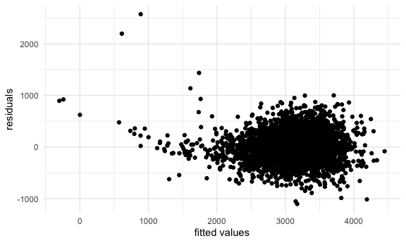
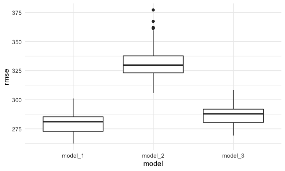

P8105 Homework 6
================
Yihan Qiu

## Problem 1

The code chunk below loads and cleans the data for regression analysis.

``` r
birthweight_data =
  read_csv("p8105_hw6_data/birthweight.csv") %>%
  janitor::clean_names() %>%
  mutate(
    babysex = as.factor(babysex),
    frace = as.factor(frace),
    malform = as.factor(malform),
    mrace = as.factor(mrace))
```

    ## Rows: 4342 Columns: 20

    ## ── Column specification ────────────────────────────────────────────────────────
    ## Delimiter: ","
    ## dbl (20): babysex, bhead, blength, bwt, delwt, fincome, frace, gaweeks, malf...

    ## 
    ## ℹ Use `spec()` to retrieve the full column specification for this data.
    ## ℹ Specify the column types or set `show_col_types = FALSE` to quiet this message.

``` r
map(.x = birthweight_data, ~sum(is.na(.x)))
```

    ## $babysex
    ## [1] 0
    ## 
    ## $bhead
    ## [1] 0
    ## 
    ## $blength
    ## [1] 0
    ## 
    ## $bwt
    ## [1] 0
    ## 
    ## $delwt
    ## [1] 0
    ## 
    ## $fincome
    ## [1] 0
    ## 
    ## $frace
    ## [1] 0
    ## 
    ## $gaweeks
    ## [1] 0
    ## 
    ## $malform
    ## [1] 0
    ## 
    ## $menarche
    ## [1] 0
    ## 
    ## $mheight
    ## [1] 0
    ## 
    ## $momage
    ## [1] 0
    ## 
    ## $mrace
    ## [1] 0
    ## 
    ## $parity
    ## [1] 0
    ## 
    ## $pnumlbw
    ## [1] 0
    ## 
    ## $pnumsga
    ## [1] 0
    ## 
    ## $ppbmi
    ## [1] 0
    ## 
    ## $ppwt
    ## [1] 0
    ## 
    ## $smoken
    ## [1] 0
    ## 
    ## $wtgain
    ## [1] 0

``` r
birthweight_data
```

    ## # A tibble: 4,342 × 20
    ##    babysex bhead blength   bwt delwt fincome frace gaweeks malform menarche
    ##    <fct>   <dbl>   <dbl> <dbl> <dbl>   <dbl> <fct>   <dbl> <fct>      <dbl>
    ##  1 2          34      51  3629   177      35 1        39.9 0             13
    ##  2 1          34      48  3062   156      65 2        25.9 0             14
    ##  3 2          36      50  3345   148      85 1        39.9 0             12
    ##  4 1          34      52  3062   157      55 1        40   0             14
    ##  5 2          34      52  3374   156       5 1        41.6 0             13
    ##  6 1          33      52  3374   129      55 1        40.7 0             12
    ##  7 2          33      46  2523   126      96 2        40.3 0             14
    ##  8 2          33      49  2778   140       5 1        37.4 0             12
    ##  9 1          36      52  3515   146      85 1        40.3 0             11
    ## 10 1          33      50  3459   169      75 2        40.7 0             12
    ## # … with 4,332 more rows, and 10 more variables: mheight <dbl>, momage <dbl>,
    ## #   mrace <fct>, parity <dbl>, pnumlbw <dbl>, pnumsga <dbl>, ppbmi <dbl>,
    ## #   ppwt <dbl>, smoken <dbl>, wtgain <dbl>

The code chunk below proposes a model for regression.

``` r
model_1 = lm(bwt ~ babysex + bhead + blength + delwt + fincome + gaweeks + malform + wtgain, data = birthweight_data)

broom::tidy(model_1)
```

    ## # A tibble: 9 × 5
    ##   term        estimate std.error statistic   p.value
    ##   <chr>          <dbl>     <dbl>     <dbl>     <dbl>
    ## 1 (Intercept) -6202.      97.3     -63.7   0        
    ## 2 babysex2       33.3      8.66      3.84  1.25e-  4
    ## 3 bhead         135.       3.52     38.5   3.03e-279
    ## 4 blength        78.9      2.05     38.4   8.37e-278
    ## 5 delwt           1.55     0.215     7.22  5.96e- 13
    ## 6 fincome         1.24     0.165     7.53  6.30e- 14
    ## 7 gaweeks        12.4      1.49      8.30  1.36e- 16
    ## 8 malform1       25.1     72.4       0.346 7.29e-  1
    ## 9 wtgain          2.37     0.433     5.46  4.93e-  8

The code chunk below shows a plot of model residuals against fitted
values.

``` r
birthweight_data %>%
  add_predictions(model_1) %>%
  add_residuals(model_1) %>%
  ggplot(aes(x = pred, y = resid)) +
  geom_point() +
  labs(x = "fitted values", y = "residuals")
```



The code chunk below fits the other two models.

``` r
model_2 = lm(bwt ~ blength + gaweeks, data = birthweight_data)
broom::tidy(model_2)
```

    ## # A tibble: 3 × 5
    ##   term        estimate std.error statistic  p.value
    ##   <chr>          <dbl>     <dbl>     <dbl>    <dbl>
    ## 1 (Intercept)  -4348.      98.0      -44.4 0       
    ## 2 blength        129.       1.99      64.6 0       
    ## 3 gaweeks         27.0      1.72      15.7 2.36e-54

``` r
model_3 = lm(bwt ~ bhead + blength + babysex +
               bhead * blength + bhead * babysex + blength * babysex +
               bhead * blength * babysex, data = birthweight_data)
broom::tidy(model_3)
```

    ## # A tibble: 8 × 5
    ##   term                    estimate std.error statistic      p.value
    ##   <chr>                      <dbl>     <dbl>     <dbl>        <dbl>
    ## 1 (Intercept)            -7177.     1265.       -5.67  0.0000000149
    ## 2 bhead                    182.       38.1       4.78  0.00000184  
    ## 3 blength                  102.       26.2       3.90  0.0000992   
    ## 4 babysex2                6375.     1678.        3.80  0.000147    
    ## 5 bhead:blength             -0.554     0.780    -0.710 0.478       
    ## 6 bhead:babysex2          -198.       51.1      -3.88  0.000105    
    ## 7 blength:babysex2        -124.       35.1      -3.52  0.000429    
    ## 8 bhead:blength:babysex2     3.88      1.06      3.67  0.000245

The code chunk below makes the comparison of three models in terms of
the cross-validated prediction error.

``` r
set.seed(1)
cv = crossv_mc(birthweight_data, 100) %>%
  mutate(
    train = map(train, as_tibble),
    test = map(test, as_tibble)
  ) %>%
  mutate(
    model_1 = map(.x = train, ~lm(bwt ~ babysex + bhead + blength + delwt + fincome + gaweeks + malform + wtgain, data = .x)),
    model_2 = map(.x = train, ~lm(bwt ~ blength + gaweeks, data = .x)),
    model_3 = map(.x = train, ~lm(bwt ~ bhead + blength + babysex +
               bhead * blength + bhead * babysex + blength * babysex +
               bhead * blength * babysex, data = birthweight_data))) %>%
  mutate(rmse_model_1 = map2_dbl(.x = model_1, .y = test, ~rmse(model = .x, data = .y)),
         rmse_model_2 = map2_dbl(.x = model_2, .y = test, ~rmse(model = .x, data = .y)),
         rmse_model_3 = map2_dbl(.x = model_3, .y = test, ~rmse(model = .x, data = .y)))

cv
```

    ## # A tibble: 100 × 9
    ##    train                 test  .id   model_1 model_2 model_3 rmse_model_1 rmse_model_2
    ##    <list>                <lis> <chr> <list>  <list>  <list>         <dbl>        <dbl>
    ##  1 <tibble [3,473 × 20]> <tib… 001   <lm>    <lm>    <lm>            288.         360.
    ##  2 <tibble [3,473 × 20]> <tib… 002   <lm>    <lm>    <lm>            276.         322.
    ##  3 <tibble [3,473 × 20]> <tib… 003   <lm>    <lm>    <lm>            269.         307.
    ##  4 <tibble [3,473 × 20]> <tib… 004   <lm>    <lm>    <lm>            292.         337.
    ##  5 <tibble [3,473 × 20]> <tib… 005   <lm>    <lm>    <lm>            292.         367.
    ##  6 <tibble [3,473 × 20]> <tib… 006   <lm>    <lm>    <lm>            274.         314.
    ##  7 <tibble [3,473 × 20]> <tib… 007   <lm>    <lm>    <lm>            282.         357.
    ##  8 <tibble [3,473 × 20]> <tib… 008   <lm>    <lm>    <lm>            295.         346.
    ##  9 <tibble [3,473 × 20]> <tib… 009   <lm>    <lm>    <lm>            279.         327.
    ## 10 <tibble [3,473 × 20]> <tib… 010   <lm>    <lm>    <lm>            281.         338.
    ## # … with 90 more rows, and 1 more variable: rmse_model_3 <dbl>

The code chunk below looks at RMSE distributions of three models.

``` r
cv %>%
  select(starts_with("rmse")) %>%
  pivot_longer(rmse_model_1:rmse_model_3,
               names_to = "model",
               values_to = "rmse",
               names_prefix = "rmse_") %>%
  ggplot(aes(x = model, y = rmse)) + 
  geom_boxplot()
```



From the boxplot above, we can see that the model I proposed has the
smallest predicion error overall, while the model using length at birth
and gestational age as predictors has the largest error in general.
