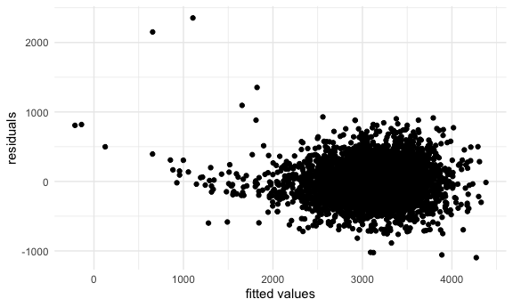
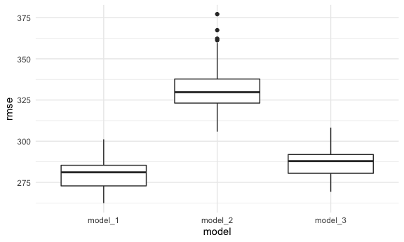
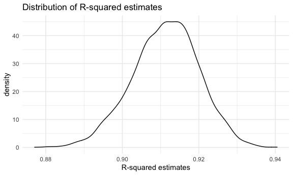
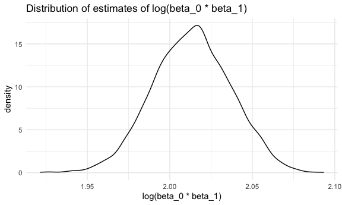

P8105 Homework 6
================
Yihan Qiu

## Problem 1

The code chunk below loads and cleans the data for regression analysis.

``` r
birthweight_data =
  read_csv("p8105_hw6_data/birthweight.csv") %>%
  janitor::clean_names() %>%
  mutate(
    babysex = factor(babysex, levels = c(1, 2), labels = c("male", "female")),
    frace = factor(frace, levels = c(1, 2, 3, 4, 8, 9), labels = c("White", "Black", "Asian", "Puerto Rican", "Other", "Unknown")),
    malform = factor(malform, levels = c(0, 1), labels = c("absent", "present")),
    mrace = factor(mrace, levels = c(1, 2, 3, 4, 8), labels = c("White", "Black", "Asian", "Puerto Rican", "Other")))
```

    ## Rows: 4342 Columns: 20

    ## ── Column specification ────────────────────────────────────────────────────────
    ## Delimiter: ","
    ## dbl (20): babysex, bhead, blength, bwt, delwt, fincome, frace, gaweeks, malf...

    ## 
    ## ℹ Use `spec()` to retrieve the full column specification for this data.
    ## ℹ Specify the column types or set `show_col_types = FALSE` to quiet this message.

``` r
map(.x = birthweight_data, ~sum(is.na(.x)))
```

    ## $babysex
    ## [1] 0
    ## 
    ## $bhead
    ## [1] 0
    ## 
    ## $blength
    ## [1] 0
    ## 
    ## $bwt
    ## [1] 0
    ## 
    ## $delwt
    ## [1] 0
    ## 
    ## $fincome
    ## [1] 0
    ## 
    ## $frace
    ## [1] 0
    ## 
    ## $gaweeks
    ## [1] 0
    ## 
    ## $malform
    ## [1] 0
    ## 
    ## $menarche
    ## [1] 0
    ## 
    ## $mheight
    ## [1] 0
    ## 
    ## $momage
    ## [1] 0
    ## 
    ## $mrace
    ## [1] 0
    ## 
    ## $parity
    ## [1] 0
    ## 
    ## $pnumlbw
    ## [1] 0
    ## 
    ## $pnumsga
    ## [1] 0
    ## 
    ## $ppbmi
    ## [1] 0
    ## 
    ## $ppwt
    ## [1] 0
    ## 
    ## $smoken
    ## [1] 0
    ## 
    ## $wtgain
    ## [1] 0

``` r
birthweight_data
```

    ## # A tibble: 4,342 × 20
    ##    babysex bhead blength   bwt delwt fincome frace gaweeks malform menarche
    ##    <fct>   <dbl>   <dbl> <dbl> <dbl>   <dbl> <fct>   <dbl> <fct>      <dbl>
    ##  1 female     34      51  3629   177      35 White    39.9 absent        13
    ##  2 male       34      48  3062   156      65 Black    25.9 absent        14
    ##  3 female     36      50  3345   148      85 White    39.9 absent        12
    ##  4 male       34      52  3062   157      55 White    40   absent        14
    ##  5 female     34      52  3374   156       5 White    41.6 absent        13
    ##  6 male       33      52  3374   129      55 White    40.7 absent        12
    ##  7 female     33      46  2523   126      96 Black    40.3 absent        14
    ##  8 female     33      49  2778   140       5 White    37.4 absent        12
    ##  9 male       36      52  3515   146      85 White    40.3 absent        11
    ## 10 male       33      50  3459   169      75 Black    40.7 absent        12
    ## # … with 4,332 more rows, and 10 more variables: mheight <dbl>, momage <dbl>,
    ## #   mrace <fct>, parity <dbl>, pnumlbw <dbl>, pnumsga <dbl>, ppbmi <dbl>,
    ## #   ppwt <dbl>, smoken <dbl>, wtgain <dbl>

There is no missing value in this dataset.

The code chunk below proposes a model for regression. To ensure its
validity and reliability, I will use the backward elimination method to
construct this model. This method first starts with all predictors in
the model and removes the predictor with the highest p-value one at a
time until all non-significant predictors have been removed.

``` r
full_reg = lm(bwt ~ ., data = birthweight_data)
backward_elimation = step(full_reg, direction = 'backward')
```

    ## Start:  AIC=48717.83
    ## bwt ~ babysex + bhead + blength + delwt + fincome + frace + gaweeks + 
    ##     malform + menarche + mheight + momage + mrace + parity + 
    ##     pnumlbw + pnumsga + ppbmi + ppwt + smoken + wtgain
    ## 
    ## 
    ## Step:  AIC=48717.83
    ## bwt ~ babysex + bhead + blength + delwt + fincome + frace + gaweeks + 
    ##     malform + menarche + mheight + momage + mrace + parity + 
    ##     pnumlbw + pnumsga + ppbmi + ppwt + smoken
    ## 
    ## 
    ## Step:  AIC=48717.83
    ## bwt ~ babysex + bhead + blength + delwt + fincome + frace + gaweeks + 
    ##     malform + menarche + mheight + momage + mrace + parity + 
    ##     pnumlbw + ppbmi + ppwt + smoken
    ## 
    ## 
    ## Step:  AIC=48717.83
    ## bwt ~ babysex + bhead + blength + delwt + fincome + frace + gaweeks + 
    ##     malform + menarche + mheight + momage + mrace + parity + 
    ##     ppbmi + ppwt + smoken
    ## 
    ##            Df Sum of Sq       RSS   AIC
    ## - frace     4    124365 320848704 48712
    ## - malform   1      1419 320725757 48716
    ## - ppbmi     1      6346 320730684 48716
    ## - momage    1     28661 320752999 48716
    ## - mheight   1     66886 320791224 48717
    ## - menarche  1    111679 320836018 48717
    ## - ppwt      1    131132 320855470 48718
    ## <none>                  320724338 48718
    ## - fincome   1    193454 320917792 48718
    ## - parity    1    413584 321137922 48721
    ## - mrace     3    868321 321592659 48724
    ## - babysex   1    853796 321578134 48727
    ## - gaweeks   1   4611823 325336161 48778
    ## - smoken    1   5076393 325800732 48784
    ## - delwt     1   8008891 328733230 48823
    ## - blength   1 102050296 422774634 49915
    ## - bhead     1 106535716 427260054 49961
    ## 
    ## Step:  AIC=48711.51
    ## bwt ~ babysex + bhead + blength + delwt + fincome + gaweeks + 
    ##     malform + menarche + mheight + momage + mrace + parity + 
    ##     ppbmi + ppwt + smoken
    ## 
    ##            Df Sum of Sq       RSS   AIC
    ## - malform   1      1447 320850151 48710
    ## - ppbmi     1      6975 320855679 48710
    ## - momage    1     28379 320877083 48710
    ## - mheight   1     69502 320918206 48710
    ## - menarche  1    115708 320964411 48711
    ## - ppwt      1    133961 320982665 48711
    ## <none>                  320848704 48712
    ## - fincome   1    194405 321043108 48712
    ## - parity    1    414687 321263390 48715
    ## - babysex   1    852133 321700837 48721
    ## - gaweeks   1   4625208 325473911 48772
    ## - smoken    1   5036389 325885093 48777
    ## - delwt     1   8013099 328861802 48817
    ## - mrace     3  13540415 334389119 48885
    ## - blength   1 101995688 422844392 49908
    ## - bhead     1 106662962 427511666 49956
    ## 
    ## Step:  AIC=48709.53
    ## bwt ~ babysex + bhead + blength + delwt + fincome + gaweeks + 
    ##     menarche + mheight + momage + mrace + parity + ppbmi + ppwt + 
    ##     smoken
    ## 
    ##            Df Sum of Sq       RSS   AIC
    ## - ppbmi     1      6928 320857079 48708
    ## - momage    1     28660 320878811 48708
    ## - mheight   1     69320 320919470 48708
    ## - menarche  1    116027 320966177 48709
    ## - ppwt      1    133894 320984044 48709
    ## <none>                  320850151 48710
    ## - fincome   1    193784 321043934 48710
    ## - parity    1    414482 321264633 48713
    ## - babysex   1    851279 321701430 48719
    ## - gaweeks   1   4624003 325474154 48770
    ## - smoken    1   5035195 325885346 48775
    ## - delwt     1   8029079 328879230 48815
    ## - mrace     3  13553320 334403471 48883
    ## - blength   1 102009225 422859375 49906
    ## - bhead     1 106675331 427525481 49954
    ## 
    ## Step:  AIC=48707.63
    ## bwt ~ babysex + bhead + blength + delwt + fincome + gaweeks + 
    ##     menarche + mheight + momage + mrace + parity + ppwt + smoken
    ## 
    ##            Df Sum of Sq       RSS   AIC
    ## - momage    1     29211 320886290 48706
    ## - menarche  1    117635 320974714 48707
    ## <none>                  320857079 48708
    ## - fincome   1    195199 321052278 48708
    ## - parity    1    412984 321270064 48711
    ## - babysex   1    850020 321707099 48717
    ## - mheight   1   1078673 321935752 48720
    ## - ppwt      1   2934023 323791103 48745
    ## - gaweeks   1   4621504 325478583 48768
    ## - smoken    1   5039368 325896447 48773
    ## - delwt     1   8024939 328882018 48813
    ## - mrace     3  13551444 334408523 48881
    ## - blength   1 102018559 422875638 49904
    ## - bhead     1 106821342 427678421 49953
    ## 
    ## Step:  AIC=48706.02
    ## bwt ~ babysex + bhead + blength + delwt + fincome + gaweeks + 
    ##     menarche + mheight + mrace + parity + ppwt + smoken
    ## 
    ##            Df Sum of Sq       RSS   AIC
    ## - menarche  1    100121 320986412 48705
    ## <none>                  320886290 48706
    ## - fincome   1    240800 321127090 48707
    ## - parity    1    431433 321317724 48710
    ## - babysex   1    841278 321727568 48715
    ## - mheight   1   1076739 321963029 48719
    ## - ppwt      1   2913653 323799943 48743
    ## - gaweeks   1   4676469 325562760 48767
    ## - smoken    1   5045104 325931394 48772
    ## - delwt     1   8000672 328886962 48811
    ## - mrace     3  14667730 335554021 48894
    ## - blength   1 101990556 422876847 49902
    ## - bhead     1 106864308 427750598 49952
    ## 
    ## Step:  AIC=48705.38
    ## bwt ~ babysex + bhead + blength + delwt + fincome + gaweeks + 
    ##     mheight + mrace + parity + ppwt + smoken
    ## 
    ##           Df Sum of Sq       RSS   AIC
    ## <none>                 320986412 48705
    ## - fincome  1    245637 321232048 48707
    ## - parity   1    422770 321409181 48709
    ## - babysex  1    846134 321832545 48715
    ## - mheight  1   1012240 321998651 48717
    ## - ppwt     1   2907049 323893461 48743
    ## - gaweeks  1   4662501 325648912 48766
    ## - smoken   1   5073849 326060260 48771
    ## - delwt    1   8137459 329123871 48812
    ## - mrace    3  14683609 335670021 48894
    ## - blength  1 102191779 423178191 49903
    ## - bhead    1 106779754 427766166 49950

``` r
summary(backward_elimation)
```

    ## 
    ## Call:
    ## lm(formula = bwt ~ babysex + bhead + blength + delwt + fincome + 
    ##     gaweeks + mheight + mrace + parity + ppwt + smoken, data = birthweight_data)
    ## 
    ## Residuals:
    ##      Min       1Q   Median       3Q      Max 
    ## -1097.18  -185.52    -3.39   174.14  2353.44 
    ## 
    ## Coefficients:
    ##                     Estimate Std. Error t value Pr(>|t|)    
    ## (Intercept)       -6098.8219   137.5463 -44.340  < 2e-16 ***
    ## babysexfemale        28.5580     8.4549   3.378 0.000737 ***
    ## bhead               130.7770     3.4466  37.944  < 2e-16 ***
    ## blength              74.9471     2.0190  37.120  < 2e-16 ***
    ## delwt                 4.1067     0.3921  10.475  < 2e-16 ***
    ## fincome               0.3180     0.1747   1.820 0.068844 .  
    ## gaweeks              11.5925     1.4621   7.929 2.79e-15 ***
    ## mheight               6.5940     1.7849   3.694 0.000223 ***
    ## mraceBlack         -138.7925     9.9071 -14.009  < 2e-16 ***
    ## mraceAsian          -74.8868    42.3146  -1.770 0.076837 .  
    ## mracePuerto Rican  -100.6781    19.3247  -5.210 1.98e-07 ***
    ## parity               96.3047    40.3362   2.388 0.017004 *  
    ## ppwt                 -2.6756     0.4274  -6.261 4.20e-10 ***
    ## smoken               -4.8434     0.5856  -8.271  < 2e-16 ***
    ## ---
    ## Signif. codes:  0 '***' 0.001 '**' 0.01 '*' 0.05 '.' 0.1 ' ' 1
    ## 
    ## Residual standard error: 272.3 on 4328 degrees of freedom
    ## Multiple R-squared:  0.7181, Adjusted R-squared:  0.7173 
    ## F-statistic: 848.1 on 13 and 4328 DF,  p-value: < 2.2e-16

From the summary above, we can see that predictors babysex, bhead,
blength, dewlt, fincome, gaweeks, mheight, mrace, parity, ppwt, and
smoken are significant. Therefore, I decide to include all of them in my
model.

``` r
model_1 = lm(bwt ~ babysex + bhead + blength + delwt + fincome + 
    gaweeks + mheight + mrace + parity + ppwt + smoken, data = birthweight_data)

broom::tidy(model_1)
```

    ## # A tibble: 14 × 5
    ##    term               estimate std.error statistic   p.value
    ##    <chr>                 <dbl>     <dbl>     <dbl>     <dbl>
    ##  1 (Intercept)       -6099.      138.       -44.3  0        
    ##  2 babysexfemale        28.6       8.45       3.38 7.37e-  4
    ##  3 bhead               131.        3.45      37.9  3.10e-272
    ##  4 blength              74.9       2.02      37.1  4.29e-262
    ##  5 delwt                 4.11      0.392     10.5  2.26e- 25
    ##  6 fincome               0.318     0.175      1.82 6.88e-  2
    ##  7 gaweeks              11.6       1.46       7.93 2.79e- 15
    ##  8 mheight               6.59      1.78       3.69 2.23e-  4
    ##  9 mraceBlack         -139.        9.91     -14.0  1.21e- 43
    ## 10 mraceAsian          -74.9      42.3       -1.77 7.68e-  2
    ## 11 mracePuerto Rican  -101.       19.3       -5.21 1.98e-  7
    ## 12 parity               96.3      40.3        2.39 1.70e-  2
    ## 13 ppwt                 -2.68      0.427     -6.26 4.20e- 10
    ## 14 smoken               -4.84      0.586     -8.27 1.75e- 16

The code chunk below shows a plot of model residuals against fitted
values.

``` r
birthweight_data %>%
  add_predictions(model_1) %>%
  add_residuals(model_1) %>%
  ggplot(aes(x = pred, y = resid)) +
  geom_point() +
  labs(x = "fitted values", y = "residuals")
```



The code chunk below fits the other two models.

``` r
model_2 = lm(bwt ~ blength + gaweeks, data = birthweight_data)
broom::tidy(model_2)
```

    ## # A tibble: 3 × 5
    ##   term        estimate std.error statistic  p.value
    ##   <chr>          <dbl>     <dbl>     <dbl>    <dbl>
    ## 1 (Intercept)  -4348.      98.0      -44.4 0       
    ## 2 blength        129.       1.99      64.6 0       
    ## 3 gaweeks         27.0      1.72      15.7 2.36e-54

``` r
model_3 = lm(bwt ~ bhead + blength + babysex +
               bhead * blength + bhead * babysex + blength * babysex +
               bhead * blength * babysex, data = birthweight_data)
broom::tidy(model_3)
```

    ## # A tibble: 8 × 5
    ##   term                         estimate std.error statistic      p.value
    ##   <chr>                           <dbl>     <dbl>     <dbl>        <dbl>
    ## 1 (Intercept)                 -7177.     1265.       -5.67  0.0000000149
    ## 2 bhead                         182.       38.1       4.78  0.00000184  
    ## 3 blength                       102.       26.2       3.90  0.0000992   
    ## 4 babysexfemale                6375.     1678.        3.80  0.000147    
    ## 5 bhead:blength                  -0.554     0.780    -0.710 0.478       
    ## 6 bhead:babysexfemale          -198.       51.1      -3.88  0.000105    
    ## 7 blength:babysexfemale        -124.       35.1      -3.52  0.000429    
    ## 8 bhead:blength:babysexfemale     3.88      1.06      3.67  0.000245

The code chunk below makes the comparison of three models in terms of
the cross-validated prediction error.

``` r
set.seed(1)
cv = crossv_mc(birthweight_data, 100) %>%
  mutate(
    train = map(train, as_tibble),
    test = map(test, as_tibble)
  ) %>%
  mutate(
    model_1 = map(.x = train, ~lm(bwt ~ babysex + bhead + blength + delwt + fincome + gaweeks + malform + wtgain, data = .x)),
    model_2 = map(.x = train, ~lm(bwt ~ blength + gaweeks, data = .x)),
    model_3 = map(.x = train, ~lm(bwt ~ bhead + blength + babysex +
               bhead * blength + bhead * babysex + blength * babysex +
               bhead * blength * babysex, data = birthweight_data))) %>%
  mutate(rmse_model_1 = map2_dbl(.x = model_1, .y = test, ~rmse(model = .x, data = .y)),
         rmse_model_2 = map2_dbl(.x = model_2, .y = test, ~rmse(model = .x, data = .y)),
         rmse_model_3 = map2_dbl(.x = model_3, .y = test, ~rmse(model = .x, data = .y)))

cv
```

    ## # A tibble: 100 × 9
    ##    train                 test  .id   model_1 model_2 model_3 rmse_model_1 rmse_model_2
    ##    <list>                <lis> <chr> <list>  <list>  <list>         <dbl>        <dbl>
    ##  1 <tibble [3,473 × 20]> <tib… 001   <lm>    <lm>    <lm>            288.         360.
    ##  2 <tibble [3,473 × 20]> <tib… 002   <lm>    <lm>    <lm>            276.         322.
    ##  3 <tibble [3,473 × 20]> <tib… 003   <lm>    <lm>    <lm>            269.         307.
    ##  4 <tibble [3,473 × 20]> <tib… 004   <lm>    <lm>    <lm>            292.         337.
    ##  5 <tibble [3,473 × 20]> <tib… 005   <lm>    <lm>    <lm>            292.         367.
    ##  6 <tibble [3,473 × 20]> <tib… 006   <lm>    <lm>    <lm>            274.         314.
    ##  7 <tibble [3,473 × 20]> <tib… 007   <lm>    <lm>    <lm>            282.         357.
    ##  8 <tibble [3,473 × 20]> <tib… 008   <lm>    <lm>    <lm>            295.         346.
    ##  9 <tibble [3,473 × 20]> <tib… 009   <lm>    <lm>    <lm>            279.         327.
    ## 10 <tibble [3,473 × 20]> <tib… 010   <lm>    <lm>    <lm>            281.         338.
    ## # … with 90 more rows, and 1 more variable: rmse_model_3 <dbl>

The code chunk below looks at RMSE distributions of three models.

``` r
cv %>%
  select(starts_with("rmse")) %>%
  pivot_longer(rmse_model_1:rmse_model_3,
               names_to = "model",
               values_to = "rmse",
               names_prefix = "rmse_") %>%
  ggplot(aes(x = model, y = rmse)) + 
  geom_boxplot()
```



From the boxplot above, we can see that the model I proposed has the
smallest predicion error overall, while the model using length at birth
and gestational age as predictors has the largest error in general.

## Problem 2

The code chunk below downloads the 2017 Central Park Weather Data.

``` r
weather_df = 
  rnoaa::meteo_pull_monitors(
    c("USW00094728"),
    var = c("PRCP", "TMIN", "TMAX"), 
    date_min = "2017-01-01",
    date_max = "2017-12-31") %>%
  mutate(
    name = recode(id, USW00094728 = "CentralPark_NY"),
    tmin = tmin / 10,
    tmax = tmax / 10) %>%
  select(name, id, everything())
```

    ## Registered S3 method overwritten by 'hoardr':
    ##   method           from
    ##   print.cache_info httr

    ## using cached file: ~/Library/Caches/R/noaa_ghcnd/USW00094728.dly

    ## date created (size, mb): 2021-10-15 18:12:56 (7.605)

    ## file min/max dates: 1869-01-01 / 2021-10-31

The code chunk below draws 5000 bootstrap samples.

``` r
bootstrap_df = weather_df %>%
  bootstrap(n = 5000, id = "strap_number")
```

The code chunk below produces estimates of R-squared for each bootstrap
sample.

``` r
r_squared = bootstrap_df %>%
  mutate(
    models = map(.x = strap, ~lm(tmax ~ tmin, data = .x)),
    results = map(models, broom::glance)
  ) %>%
  unnest(results) %>%
  select(strap_number, r.squared)
```

The code chunk below plots the distribution of estimates of R-squared.

``` r
r_squared %>%
  ggplot(aes(r.squared)) +
  geom_density() +
  labs(title = "Distribution of R-squared estimates", x = "R-squared estimates")
```



From the plot above, we can see that the distribution of estimates of
R-squared is approximately normal, with mean centered around 0.91.

The code chunk below constructs a 95% confidence interval for R-squared.

``` r
r_squared %>%
  summarize(
    lower_bound = quantile(r.squared, 0.025),
    upper_bound = quantile(r.squared, 0.975)
  )
```

    ## # A tibble: 1 × 2
    ##   lower_bound upper_bound
    ##         <dbl>       <dbl>
    ## 1       0.894       0.927

The 95% confidence interval for R-squared is (0.8939688, 0.9270405).

The code chunk below produces estimates of log(beta\_0 \* beta\_1) for
each bootstrap sample.

``` r
log_beta0_beta1 = bootstrap_df %>%
  mutate(
    models = map(.x = strap, ~lm(tmax ~ tmin, data = .x)),
    results = map(models, broom::tidy)) %>%
  unnest(results) %>%
  select(strap_number, term, estimate) %>%
  pivot_wider(
    names_from = "term",
    values_from = "estimate"
  ) %>%
  rename(beta_0 = `(Intercept)`, beta_1 = tmin) %>%
  mutate(log_beta0_times_beta1 = log(beta_0 * beta_1))
```

The code chunk below plots the distribution of estimates of log(beta\_0
\* beta\_1).

``` r
log_beta0_beta1 %>%
  ggplot(aes(log_beta0_times_beta1)) +
  geom_density() +
  labs(
    title = "Distribution of estimates of log(beta_0 * beta_1)",
    x = "log(beta_0 * beta_1)",
  )
```



From the plot above, we can see that the distribution of estimates of
log(beta\_0 \* beta\_1) is approximately normal, with mean centered
around 2.02.

The code chunk below constructs a 95% confidence interval for
log(beta\_0 \* beta\_1).

``` r
log_beta0_beta1 %>%
  summarize(
    lower_bound = quantile(log_beta0_times_beta1, 0.025),
    upper_bound = quantile(log_beta0_times_beta1, 0.975)
  )
```

    ## # A tibble: 1 × 2
    ##   lower_bound upper_bound
    ##         <dbl>       <dbl>
    ## 1        1.97        2.06

The 95% confidence interval for log(beta\_0 \* beta\_1) is (1.965633,
2.058469).
